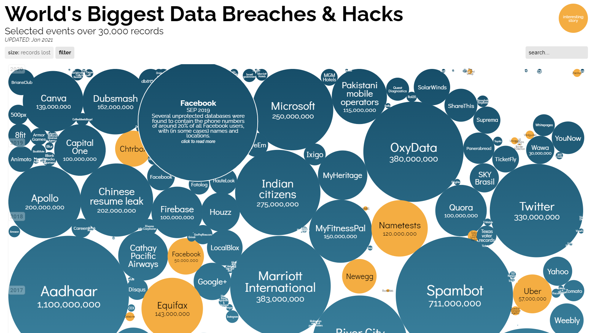

# Week 6 Reflection

Ryan LaMarche

Source: [https://www.informationisbeautiful.net/visualizations/worlds-biggest-data-breaches-hacks/](https://www.informationisbeautiful.net/visualizations/worlds-biggest-data-breaches-hacks/)

## Reflection

This is an interactive bubble chart of some of the world's largest data breaches. The data is laid out on a time axis, and the size of the bubble represents the size of the data breach. The bubbles that are colored orange are the ones that have an "interesting story," other than that the only encoding is the size of the data breach. I really like this data visualization because it has an initial impact on the user when they first look at it, but hovering and clicking the data points allows you to "dive deeper." When hovering the data points, you get a short description of the attack, and by clicking the bubble you will be linked to an article that describes the attack in more detail. I think bubble charts have some flaws, particularly with comparison tasks, since humans are not very good at comparing the area of two shapes when they are not aligned on a common axis. However, this chart seems like it is aimed more at "discovery" style tasks, with the ability to click to learn more. There are also some interactive filters to browse a particular sector or attack method, which can be helpful for different search/discovery tasks when looking at the data.
