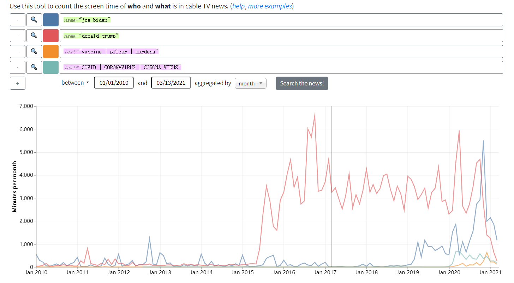
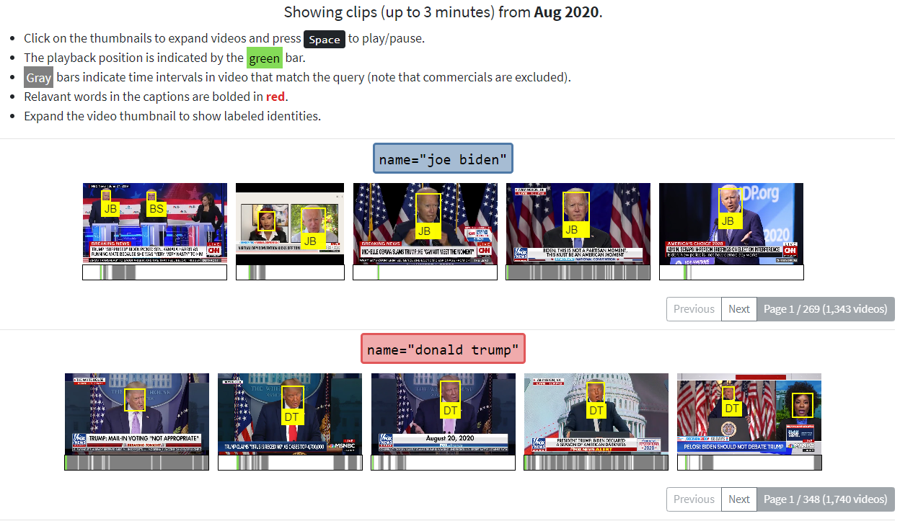

# Week 6 Reflection

Resource link: [Stanford Cable TV News Analyzer](https://tvnews.stanford.edu/?dataVersion=v1&data=eyJvcHRpb25zIjp7ImFnZ3JlZ2F0ZSI6Im1vbnRoIn0sInF1ZXJpZXMiOlt7ImNvbG9yIjoiIzRFNzlBNyIsInRleHQiOiJuYW1lPVwiam9lIGJpZGVuXCIifSx7ImNvbG9yIjoiI0UxNTc1OSIsInRleHQiOiJuYW1lPVwiZG9uYWxkIHRydW1wXCIifSx7ImNvbG9yIjoiI0YyOEUyQiIsInRleHQiOiJ0ZXh0PVwidmFjY2luZSB8IHBmaXplciB8IG1vcmRlbmFcIiJ9LHsiY29sb3IiOiIjNzZCN0IyIiwidGV4dCI6InRleHQ9XCJDT1ZJRCB8IENPUk9OQVZJUlVTIHwgQ09ST05BIFZJUlVTXCIifV19)

This is a research project from the Computer Graphics Lab at Stanford University. 

The Stanford TV News Analyzer has applied deep-learning-based image and audio analysis processing techniques to nearly a decade of 24-7 broadcasts from Fox News, CNN, and MSNBC going back to January 1, 2010. That's over 270,000 hours of video updated daily. Computer vision is used to detect faces, identify public figures, and estimate characteristics such as gender to examine news coverage patterns. To facilitate topic analysis the transcripts are time-aligned with video content, and compared across dates, times of day and programs. 

We can search for topics or people, combine queries, and set time ranges. Then we get a time series for how much someone’s face showed up or the number of times a word was used. We can see this line chart in figure-1. If we are interested in a specific time point, we can click the chart. Then this visualization will provide marked clips below, we can play those videos. We can see it in figure-2.

This project combines data visualization, deep learning and computer vision. It is very impressive to me, the combination is amazing.

*figure-1*

*figure-2*
