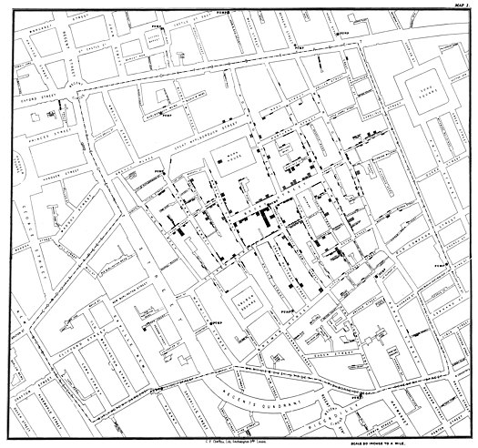

# Week 6 Reflection - [John Snow's 1854 Broad Street Cholera Outbreak](https://en.wikipedia.org/wiki/1854_Broad_Street_cholera_outbreak)

For a brief background, in 1854 in the Soho district of Westminster, London, England, there was a breakout of cholera near what is now Broadwick Street. The outbreak itself is not known for its impact, however. It is the results of a study done by the physician John Snow. It ended up leading to increasing public health and sanitation facilities.

The visualization itself is quite astounding as it unintentionally represents a dot map. Each black bar represents the number of cholera deaths at each household int he specific neighbor. It was able to determine the city blocks where which the number of deaths were higher. This lead to the realization that those who suffered from cholera drank from the same well which was found to be contaminated by sewage. This ended up creating sewage systems to protect wells from contamination.

## References
* [Tableau - Data is beautiful; #2](https://www.tableau.com/learn/articles/best-beautiful-data-visualization-examples)