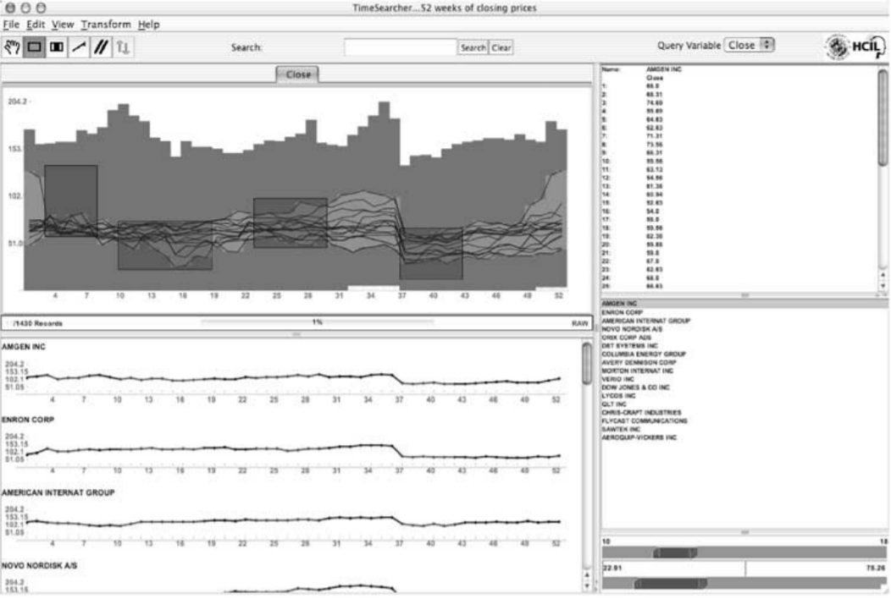
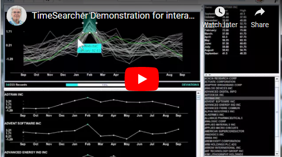

Week 6 - TimeSearcher: Visual Exploration of Time-Series Data
===
By Andrew Nolan (3-15-21)

As C term comes to a close I find myself spending an increasing amount of time working on my MQP,trying to wrap it up. We are now trying to publish our work and I have been doing a lot of research to make sure our related work section is adequate. A key part of our project involves visualizing and querying time series data. I was reading the article *Comparing Similarity Perception in Time Series Visualizations* by Gogolou, Tsandilas, Palpanas, and Bezerianos [3]. In this paper they briefly discuss the "growing interest in interactive exploration and querying of time series", that's what I'm working on! TimeSearcher, a tool from the University of Maryland's HCI lab was particularly interesting to me. So since I have to write about it for my MQP paper, I thought it would be a good tool to write about for my reflection in this class too. :)

TimeSearcher is a very popular system that provides time series analysts with a tool to perform a live similarity search of their time series data. The embeded videos on [1], show this in action. They use a tool they call a Timebox to highlight the section of the time series they want to compare [2]. Timeboxes are "a powerful graphical, direct-manipulation metaphor for the specification of queries over time-series datasets". Basically it's a drag and drop box to highlight the part of the time series you want to query. Since being released in 2005 it has gone through three iterations, the most recent version is TimeSearcher 3.

It's pretty common practice to display time series as a line plot. It's also common practice to do similarity measures between time series, either by basic measures like euclidean distance or advanced algorithms like dynamic time warping. What's novel and cool about this tool is the interactive element. Dragging and dropping a box to highlight the sections of the time series you want to perform similarity search on is a helpful feature. It seems very simple, but it provides a powerful visual element to standard time series comparison. When running time series comparison algorithms, like DTW, usually you just specify the indices of the time series subsequence you want to compare. Now, with Timeboxes you can actually see the subsequence you are comparing. The indices remain the same, but seeing the shape of the subsequence and how it rises and falls is a huge bonus for analysts.

My MQP didn't have time to implement a feature like Timeboxes this year, but it's a good idea for future work and should probably be a standard in all time series query tools.

#### Video - TimeSearcher Demo

Sources
---
1. TimeSearcher in the University of Maryland HCI Lab - http://www.cs.umd.edu/hcil/timesearcher/
2. Dynamic query tools for time series data sets:
Timebox widgets for interactive exploration - https://www.cs.umd.edu/hcil/trs/2004-26/2004-26.pdf
3. Comparing Similarity Perception in Time Series Visualizations: https://ieeexplore.ieee.org/document/8440826
4. TimeSearcher Demo: https://youtu.be/VWx1TMcrb74