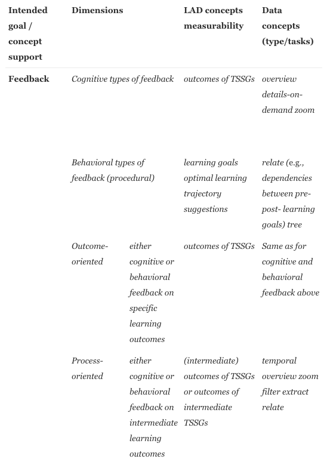

[Guiding the choice of learning dashboard visualizations: Linking dashboard design and data visualization concepts](https://www-sciencedirect-com.ezpxy-web-p-u01.wpi.edu/science/article/pii/S1045926X18301009)
===
Jyalu Wu

Thoughts
---
This week I read a paper written by Gayane Sedrakyan, Erik Mannens, and Katrien Verbert that was published in the *Journal of Computer Languages* in February 2019. Their paper discusses visualization concepts for learning analytics dashboards, which are dashboards used for education that:
>aim to support improved retention or engagement, increased social beehavior or recommendations of courses and resources, for both individual and group learning purposes.

There are many types of LADs and differ in terms of the "intended goal, stakeholders, type of learning tasks, feedback typology, and data/analytics characteristics". The paper then describes all of the educational science concepts that are related to dashboard feedback design, and then describes some visualization and design paradigms.

Then, the authors discuss their recommendations on the best dashboard design/data concepts for each educational concept. For example, their recommendations for the educational concept "Feedback" are shown below.

I thought that this was a really informative paper - I've been working on designing a dashboard myself and had been wondering what the best kinds of visualizations would be for it. So this paper helped a little in clearing that up!