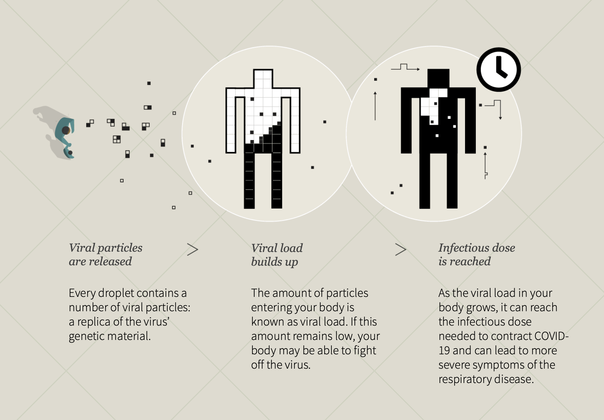

Week 6 Reflection
===

Author
---
Joseph Yuen

References
---
- [New Normal: How far is safe enough?](https://graphics.reuters.com/HEALTH-CORONAVIRUS/SOCIALDISTANCING/qzjvqenmyvx/)

Reflection
---

This Reuters data visualization differs from my previous reflections in that it is not as interactive. However, it is not as simple as a static image. Instead, the website uses the scroll feature to show the user a variety of data visualizations that all discuss how far is safe enough during COVID-19. 

In the past, I have discussed how visualizations use text to provide context information, and this vis is no exception. What I want to talk about this week, however, is how the designers used space and the scrolling mechanics of the webpage to present spatial data. In the picture below, we see a green lawn with illustrations of people on it. Each of these people represent a different country and their preferred personal space. Although it is a bit difficult to compare countries to one another as they are using a radial style, it allows users to compare the biggest to the smallest. As we move down the page, countries like Italy, China, and India stand out as they have much smaller circles compared to countries like the US. I thought that this implementation was refreshing as it was different than a simple bar chart and worked in harmony with the visual narrative.

In the 2 pictures below, you can see the same building with different overlays. As the user scrolls down, the overlay changes allowing for the user to understand a new concept within the context of the previous concept. My last reflection vis implemented a similar mechanic, but in this case, the developers used the scroll mechanism to automatically transition the overlay. I also wanted to note the use of color in these visualizations. We can see that the infected patient is colored red to draw our eyes to them immediately. 

The vis also contained other data visualizations that resembled familiar idioms. In the image below, we see that a human outline is  filled up with viral load. Even though the vis is not a scientific visualization, it demonstrates that visualizations can take artistic liberties to prove a point rather than emphasize pin point accuracy. Below that picture is a graphic that resembles a scientific chart. But instead of number values, it contains visual examples of behaviors. Although it's not as focused on numerical data, I think that it reveals how to reinvent familiar charts in an easy-to-understand manner. And below that picture, is a more traditional heat map with data blocked out. As most of the map is a solid shade of purple, the map draws attention to certain age relationships. Even though I worry about the ethics of throwing out data simply to fit a narrative, I can see from this example how filtering out certain data in a heat map can make them more understandable to a person with less experience reading them. 

Throughout the entire visualization, the user sees a map of a fictional town. This town's layout is used to not only look pretty but also show relative distances between objects such as people on a beach. The use of symbols is extremely apparent within this vis and makes reading the website more interesting than reading a paper. Even though this may seem obvious, I imagine it is a lot more complicated than making a couple graphs as it involves much more pre-planning and design expertise.

Overall, I felt that the visualization included many different data vis techniques that were designed to draw the user's attention to important elements. The data narrative in combination with the visual layout and aesthetic makes the experience so much more engaging than a static info graphic and perhaps on par with highly interactive visualizations. While user exploration is kept to a minimum in this vis, there are plenty of details that allow the user to ask questions and hopefully explore certain topics in detail on their own. 