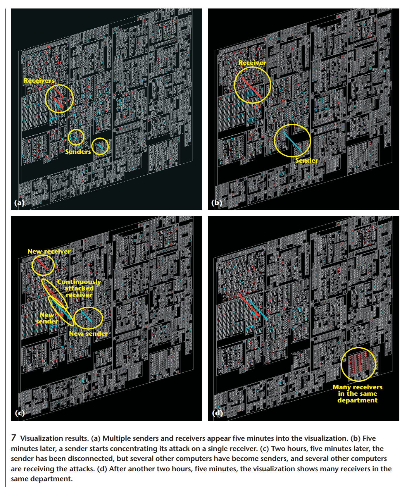

# Week 7 Reflection

## Hierarchical Visualization of Network Intrusion Detection Data

For this week's reflection I wanted to look at something having to do with hierarchical data visualization. I found this paper discussing network intrusion data and visualizing it hierarchically by IP address. Typical systems just send emails to system administrators and maintain logs or large amounts of data when there are network threats. This paper investigates ways to visualize that same data in a hierarchical manner, which makes some intuitive sense since IP addresses are assigned somewhat hierarchically. By grouping the data by bytes in an IP address, it makes it easier to identify patterns in terms of where the network attacks are coming from. This allows the network administrators to learn these patterns and make more informed decisions, such as banning ranges of IP addresses that come from an organization that pose a security risk.

There are certainly some limitations to this method, particularly relating to scalability. In the paper they address this by talking about different interactive techniques they could try (pan and zoom, click-through nodes to see more details, etc.), but really they left it as a "future-work" section. It is also a visualization that requires a certain level of expertise in the domain of cybersecurity or networking, which might be okay considering the practical application.

### Citation

Itoh, T., Takakura, H., Sawada, A., & Koyamada, K. (2006). Hierarchical visualization of network intrusion detection data. IEEE Computer Graphics and Applications, 26(2), 40-47.

https://ieeexplore.ieee.org/stamp/stamp.jsp?arnumber=1607920
