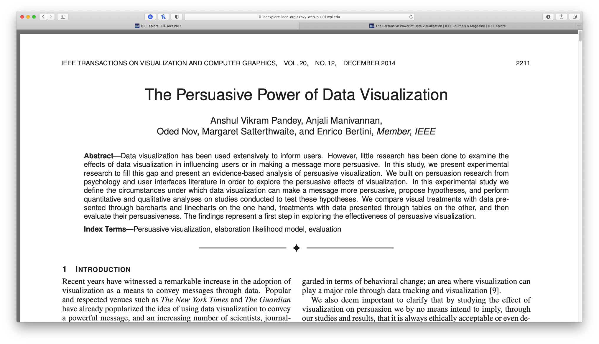

Week 7 Reflection
===

Author
---
Joseph Yuen

Paper
---
[The Persuasive Power of Data Visualization](https://ieeexplore.ieee.org/abstract/document/6876023)

Reflection
---

In previous reflections, I have analyzed narrative based visualizations that seek to inform and persuade the user on social issues such as shootings and COVID-19 prevention practices. Thus, the analysis of data visualization and its persuasive power appealed to me. 

The paper specifically studies what elements make a data visualization more or less effective in changing people's attitudes for a given subject. The authors found that charts were more effective at changing people's attitudes than tables when the recipient did not possess an initial strong attitude towards a subject. However, tables were more effective than charts when the recipient possessed an initial strong attitude towards a subject. In addition, the paper also identified reasons why people change or do not change their initial attitudes in the context of data vis, but the authors acknowledge that these claims require further analysis as persuasion is a complex concept that consists of more than simply a change in attitude about a topic. 

The main claim that charts are more effective than tables and vice versa in certain conditions is somewhat surprising to me as I typically thought of charts as easy to understand abstractions of tables. But upon studying the Elaboration Likelihood Model of Persuasion (ELM) which is a general framework for persuasion, the finding makes more sense. The ELM found that persuasion is a dual process in which the nature of persuasion depends on the receiver's elaboration of the persuasive message which can be affected by a number of factors such as motivation and relationship to the topic at hand. This elaboration can vary between recipients and makes them more or less inclined to certain components of an argument. For example, recipients with high elaboration tend to look at the quality and strength of an argument, while recipients with low elaboration tend to look at credibility and aesthetic factors. Essentially, people who are more interested and connected to the data tend to value the hard data, while people who are less interested tend to value who gave the argument and presentation of the argument. Since tables tend to be the data that feeds into the creation of a chart, I think it makes sense that people with a strong attitude towards a subject and likely a higher degree of elaboration are more convinced by the raw data. And those with a weaker attitude towards a subject may not be as invested in the topic and thus prefer aesthetically abstractions of the raw data over the raw data. Based on this discussion, I wonder if pre-surveys before looking at a data vis may be implemented to alter the presentation of a visualization. I also wonder what may happen if you show both a table and a respective chart at the same time. 

I also found the paper's discussion on why people change or not change their attitudes to be also be interested. Although the observations are not surprising, they confirmed my understanding of why people change their minds within the context of data visualization. 

Lastly, I wanted to also bring up that the authors acknowledged that they do not fully endorse the manipulative use of data vis. They understand the implications of such research and the consequences it may have on society. I have discussed similar concerns in previous reflections regarding the line between propaganda and persuasive presentations especially when using powerful data visualizations. These concerns lead me to think that overall transparency, un-biased context information, and both tables and charts may be used to eliminate any ethical issues and still maximize effectiveness.

Overall, I found the paper to be helpful when creating visualizations for a specific audience. If I know that I have polarizing topic, then I may be more inclined to show tables as people will likely want hard evidence (however extremely polarizing topic may elicit a refusal to look at the data). And if I have an audience that may be less interested in a topic, charts may be used to attract their attention and provide an abstract view of the data that fits my message.