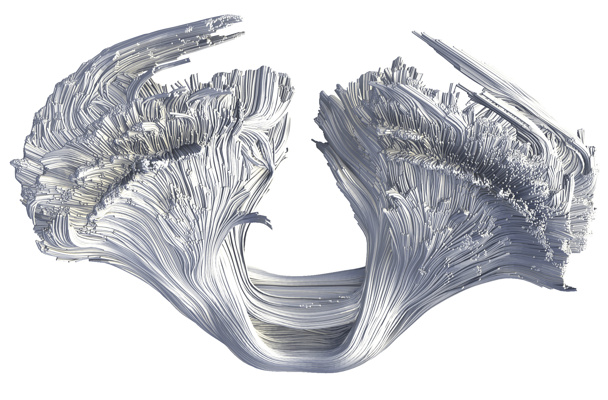

# Week 7 Reflection - [High-Quality Real-Time Raycasting and Raytracing of Streamtubes with Sparse Voxel Octrees](https://virtual.ieeevis.org/paper_s-short-1105.html)

This paper is specifically trying to visualize in real-time fiber tracks from diffusion tensor magnetic resonance imaging (MRI) from any magnification with no loss of resolution. This done using signed distance functions (SDFs) which allow any raycasted surface to appear smooth regardless of the distance to that point from the viewer. To be able to efficiently manage the hundreds of thousands of data needed to be combined, sparse voxel octrees (SVOs) are used. SVO is a rendering technique used to only compute pixels that are currently displayed. The contributions specifically made by this team is broken down into three items. The first is one converts geometric data of curves into some smoothed voxel version that can be handled by an SDF. The second involves taking those smoothed voxel data and creating an efficient SVO to render them to the screen. Finally, the third is a draw the data to the screen via raymarching.

## References

- [Video Presentation](https://youtu.be/yxHYxo2rT8c?t=4411)
- [Explanation of Raymarching and Signed Distance Functions](http://jamie-wong.com/2016/07/15/ray-marching-signed-distance-functions/#the-raymarching-algorithm)
- [Voxels](https://en.wikipedia.org/wiki/Voxel)
- [Sparse Voxel Octrees](https://en.wikipedia.org/wiki/Sparse_voxel_octree)