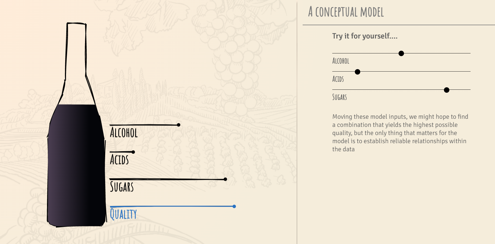
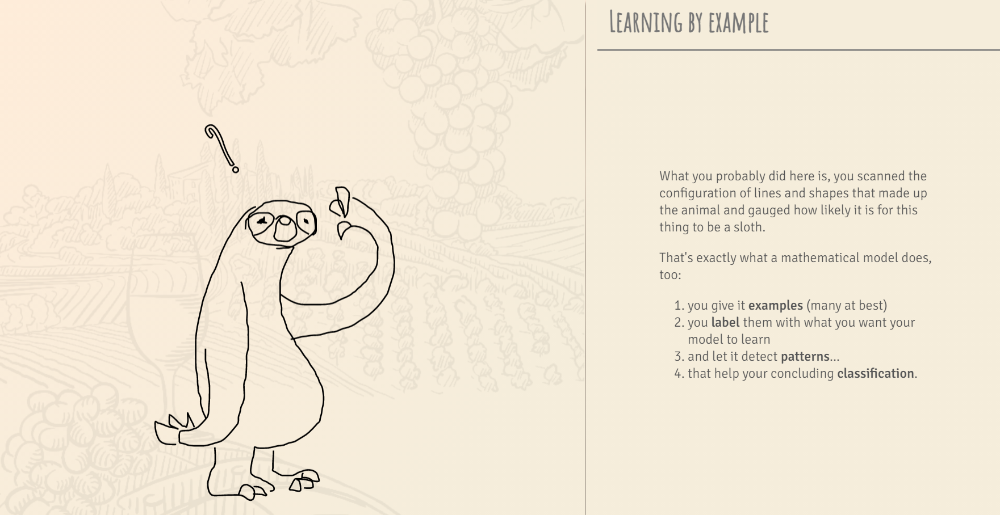

# Week 7 Reflection - Wine & Math

Resource link:

https://pudding.cool/2021/03/wine-model/

For The Pudding, Lars Verspohl provides an introduction to statistical models disguised as a lesson on finding good wine. Start with a definition of wine, which becomes a way to describe it with the numbers. Define what makes a wine good. Find the wines that look closer to that definition.

This visualization made use of cute doodles to introduce wine and statistic models, which is a easy way to get understood by anyone from any educational background. In addition, this visualization contains different kinds of charts to visualize different data set. For instance, lollipop chart, bar chart, scatter plot, etc. It also made use of color to represent wine with different quality. 

Overall, good story telling, multiple chart types, colors, and cute doodles made this visualization a good one. It deserves to be shared with my classmates.

