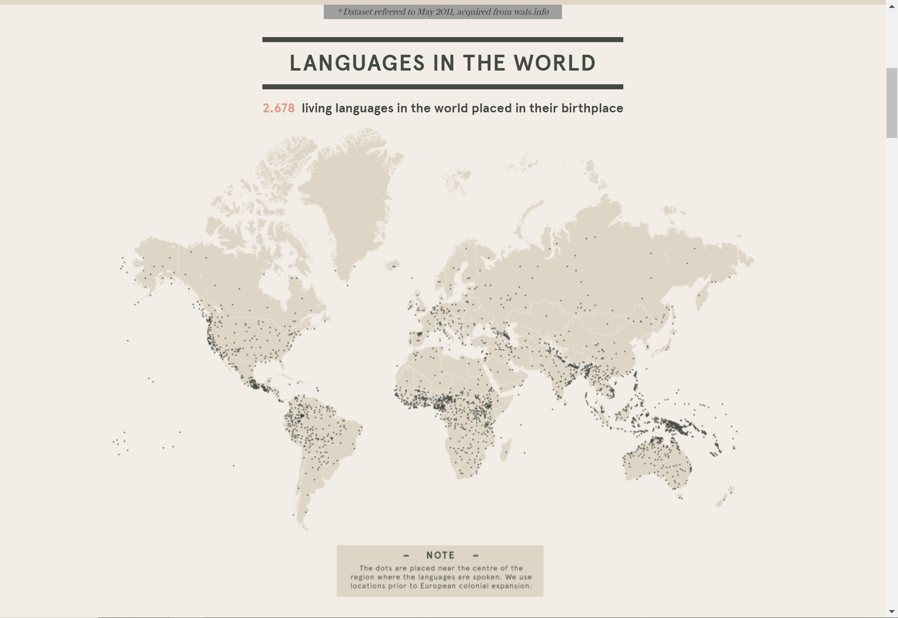
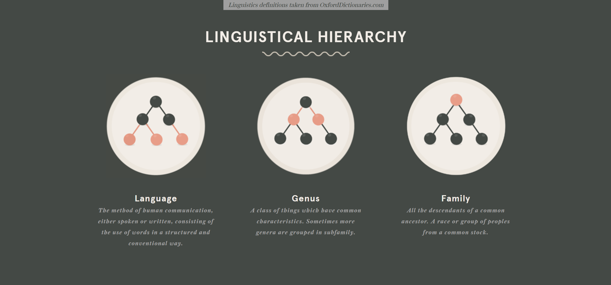
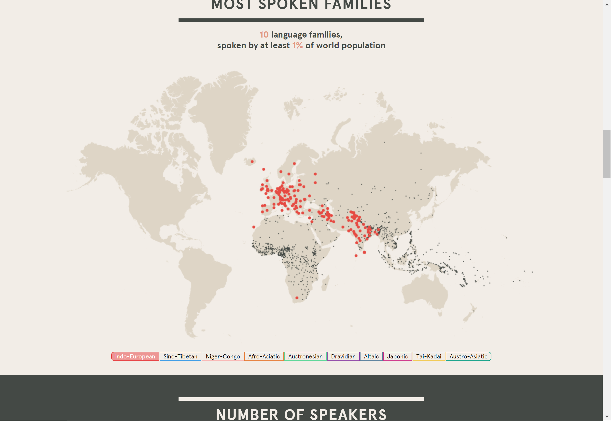
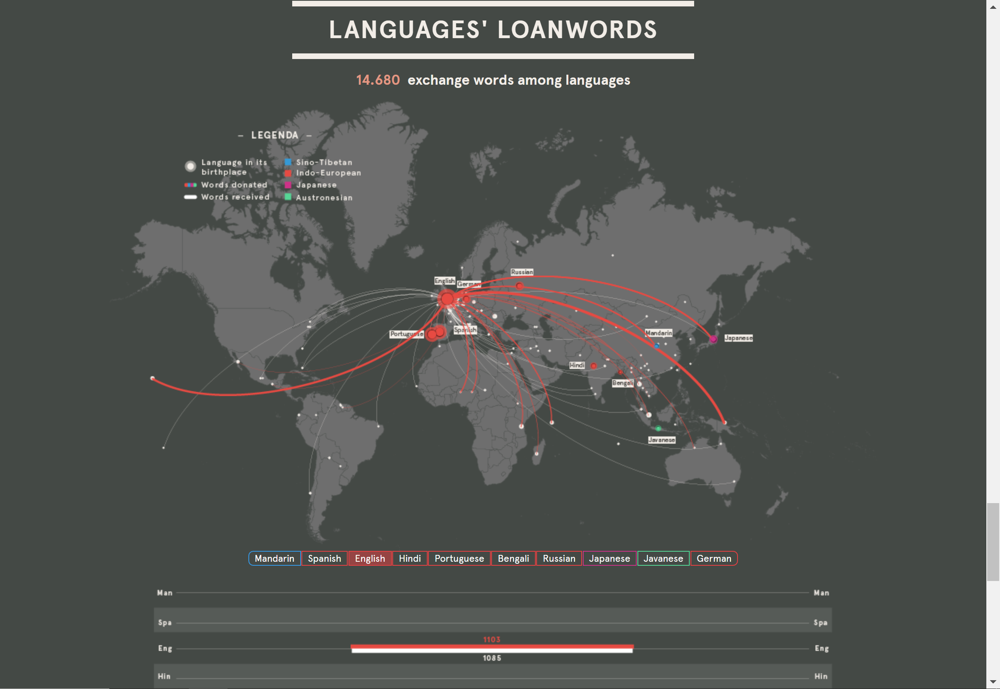

Reflection
===

link:http://www.puffpuffproject.com/languages.html    

If you are not proficient in languages, or travel the world frequently, it will difficult for you to know how many languages are in the world and where they are spoken. However, on this website, you can easily discover how many languages are in the world, discover where they originate, and the relationship between them.      

On this page, the small black dot is located near the center of the area where the language is spoken. We can easily observe the distribution of languages in the world. Some areas have dense dots, and some areas have low density, and some islands have their own language.    
    

Next, there are three picture introduction what is language and what is genus and what is family.  
    

On this page, you can see most spoken language families. When you hover over the label, all languages in the relevant spoken language group on the map will be marked with the same color as the label. Languages belonging to the same family are very close geographically on the map.    
    

At the bottom of the page, you can explore the interaction of each language and other languages. When you hover the mouse on the label, the page will show lines and connect that language with other languages. White lines indicate words received from other languages, and red lines indicate words donates to other languages. If you receive more words, the lines appear to be wider.   
      

I think there are some parts of this website design that can be worth learning. First of all, the colors used are white, gray and black, so it is easy to distinguish the area and each point on the map. The colors represented by each language family can also be easily distinguished. Interaction design allows people to focus more on the content currently selected.     
