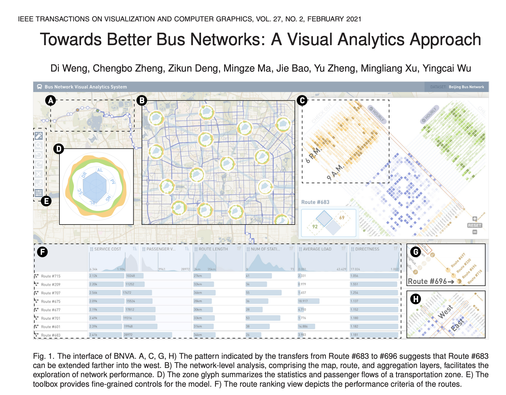

I chose this article for the week because I wanted to find something related to route optimization. The authors sought to address the challenge of revising bus routes through a visual analytics approach. The three stage process involved identifiying ineffective routes, generate alternative routes using The Pareto-optimalroute search method, and using "tailored visualizations" to facilitate the decision-making process for an optimal alternative route. The first stage included a map overview, visualization of network performance, and visualization of passenger flows. In the second stage, visualizations were used to guide the search process for generating alternative routes. In the final stage, visualizations were used to help experts compare the generated alternatives based on topologies and other performace criteria.

The Pareto-optimal route search method uses Monte Carlo Tree Search which I was happily familiar with since I am taking Artificial Intelligence this semester. Criteria included route directness, construction cost, and service cost. 

The frontend of the web-based application (BNVA) "comprises three visual interfaces, namely, the exploration, manipulation, and evaluation interfaces". The exploration interface consists of a network level overview to help identify zones with ineffective routes (zone glyph (1D): " encodes six averaged criteria, namely, route length(RL), number of stops (NS), passenger volume (PV), average load(AL), route directness (DR), and service cost (SC)."). The route level exploration uses a table for comparison (1F). Stop level analysis shows passenger flows and transfers (4A and 4F). The manipulation interface gives users control over the model for generating alternative routes for an identified ineffective route. The evaluation interface helps "users evaluate hundreds of alternative routes and identify the most optimal one". Routes are clustered by topological similarities and differences. The visualization allows users to analyze routes by performance criteria. 
