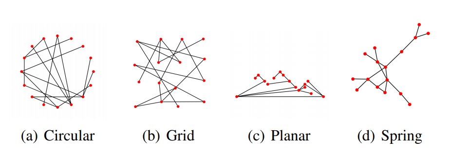
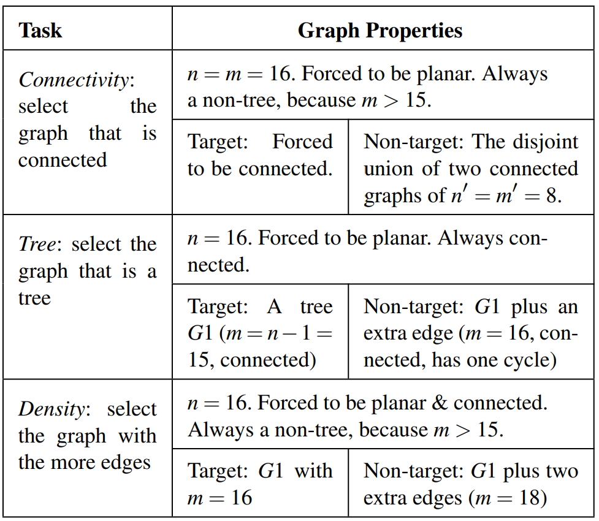

Reflection
=====
We are surrounded by graphs such as social networks, and these graphs need to be understood and analyzed. According to other studies, the visualization of a graph is the first step in analyzing its structure, because it allows us to immediately see the important features of the graph. Therefore, we need to study how humans extract information about specific graphic attributes.   
 
    
There are four types of layout are included in the experiments. They are Circular, Grid, Planar and Spring.   
 
   
During the experiment process, participants are presented two alternative images, only one of which contains the target graph, and participants need to select the graph with the desired property.    
<table>
  <caption>results</caption>
  <tr>
    <td>Connectivity</td>
    <td>The Spring layout clearly facilitated the perception of connectivity. Both the Circular and Grid layouts resulted in performance not better than chance.</td>
  </tr>
  <tr>
    <td>Tree</td>
    <td>People have a better perception of the tree property to spring layout than other layouts. The author believes that the possible reason is that the Spring layout clearly shows the existence of loops in the target graph and draws the non-target graph in the form of "strings".
</td>
  </tr>
  <tr>
    <td>Density</td>
    <td>For this task, although all layouts resulted in performance better than chance, none of them was found to be significantly better than the others.</td>
  </tr>
</table>
