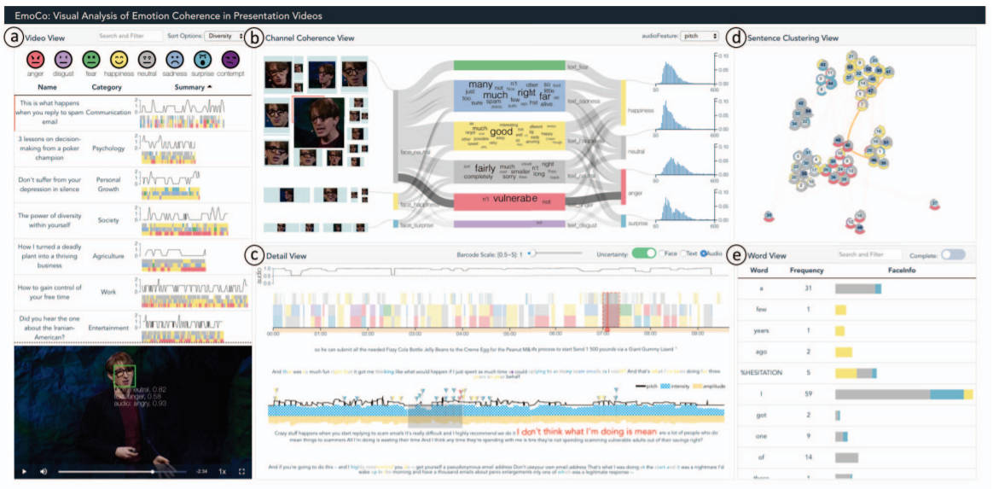

# Week 8 - EmoCo: Visual Analysis of Emotion Coherence in Presentation Videos

[Paper link](https://ieeexplore.ieee.org/document/8807235)

[PDF](EmoCo.pdf)

Authors: 
Haipeng Zeng, Xingbo Wang, Aoyu Wu, Yong Wang, Quan Li, Alex Endert and Huamin Qu

Source: 
IEEE TRANSACTIONS ON VISUALIZATION AND COMPUTER GRAPHICS, VOL. 26, NO. 1, JANUARY 2020

Abstract:
Emotions play a key role in human communication and public presentations. Human emotions are usually expressed
through multiple modalities. Therefore, exploring multimodal emotions and their coherence is of great value for understanding emotional
expressions in presentations and improving presentation skills. However, manually watching and studying presentation videos is often
tedious and time-consuming. There is a lack of tool support to help conduct an efficient and in-depth multi-level analysis. Thus, in
this paper, we introduce EmoCo, an interactive visual analytics system to facilitate efficient analysis of emotion coherence across
facial, text, and audio modalities in presentation videos. Our visualization system features a channel coherence view and a sentence
clustering view that together enable users to obtain a quick overview of emotion coherence and its temporal evolution. In addition,
a detail view and word view enable detailed exploration and comparison from the sentence level and word level, respectively. We
thoroughly evaluate the proposed system and visualization techniques through two usage scenarios based on TED Talk videos and
interviews with two domain experts. The results demonstrate the effectiveness of our system in gaining insights into emotion coherence
in presentations.

In this paper, researchers provided a method to Emotion visualization of videos from three levels: video level, sentence level, and 
word/frame level. In addition, they compared the emotion recognition results of the three levels by making use of multiple chart types, 
including line chart, dot chart, bar chart, strip chart, sankey diagram, and chord diagram. With different chart types, we can analyze
the emotion data sets from different aspects.

