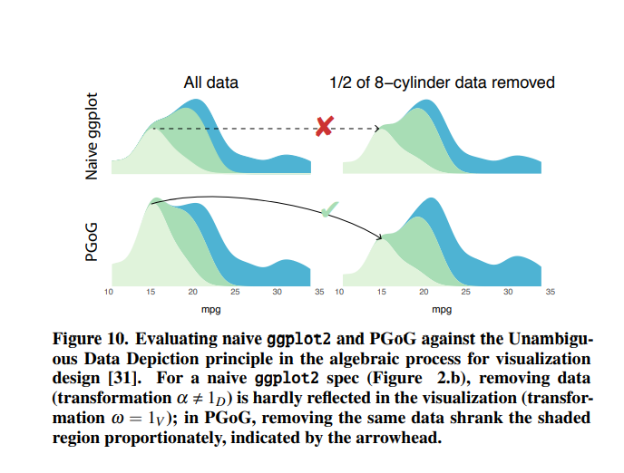

# Week 8 Reflection

## A Probabilistic Grammar of Graphics

This is a paper from CHI 2020, and I thought it was interesting because it addressed some of the data representation problems that can arise when visualizations are designed naively. They look mostly at density plots in this paper as a proof of concept, but the concept they discuss can be generalized to many other types of probabilistic visualizations. There are many pitfalls for novice visualization designers, and making sure that you are representing the data properly becomes very important. The authors discuss a model that they call Probabilistic Grammar of Graphics (PGoG), which allows the engineer to use probability expressions to describe their data. So as an example in ggplot2, rather than saying `y = stat(density*n)`, the author could instead write it probabilistically `height = P(cyl|mpg) P(mpg)`. These both produce the same chart, but the latter is more intuitive for people who think about density data from a probability perspective. In this way, people can avoid making the naiive mistake of setting `y = stat(density)`, which causes the chart to be disproportional to what the dataset actually represents.

### Citation

Xiaoying Pu and Matthew Kay. 2020. A Probabilistic Grammar of Graphics. In Proceedings of the 2020 CHI Conference on Human Factors in Computing Systems (CHI '20). Association for Computing Machinery, New York, NY, USA, 1–13. DOI:https://doi.org/10.1145/3313831.3376466
