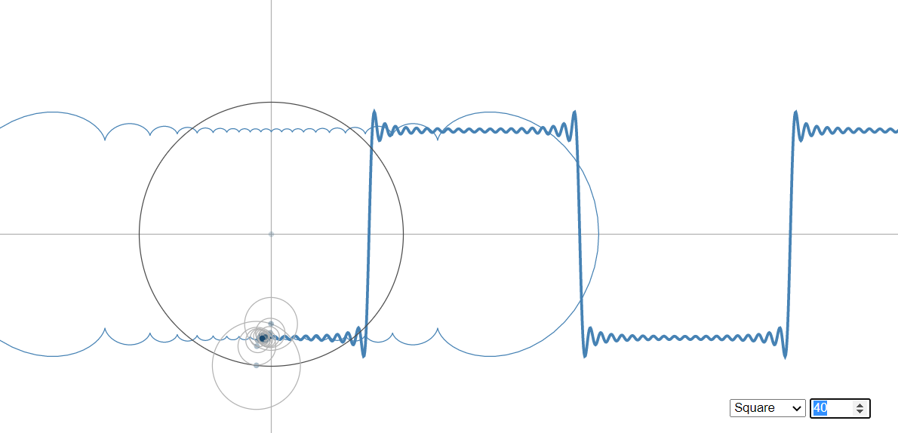

# Week 8 Reflection - [Fourier Series](https://bl.ocks.org/jinroh/7524988)

The Fourier series is simply a function that repeats at regular intervals composed of signed functions summed together. It can be used to approximate any arbitrary function given the appropriate weights. The visualization shown is one done in d3 with constructs the approximations of certain functions using this technique. As more functions are summed together, the more accurate the resultant becomes.

In this visualization, you can choose between the square, triangle, sawtooth, fibonacci, and pulse waves. Each of these are approximated using only sine waves. It goes to show the impressive magnitude of how the sums of varying functions of the same type can be used to create anything else. It's similar to how any computer algorithm could be represented within a turing machine.

## References

 - [Description](https://en.wikipedia.org/wiki/Fourier_series)