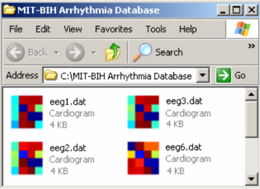

Week 8 - Time Series Bitmaps
===
By Andrew Nolan

As with many previous weeks, I am still working on my MQP paper about time series visualization/data mining. So once again, I am going to reflect on one of the papers I read for my related work section. This week I found a cool time series visualization tool for clustering and anomaly detection. Researchers Kumar et Al. from University of California - Riverside developed bitmap representations of time series that can be seen in a standard file explorer, like the one seen in the image above. Instead of displaying an icon in the browser and sorting by file size, name, type, etc... This tool allows users to display a bitmap representation of time series features and sort by similarity. The bitmap and features are displayed using "Chaos Game Theory". This approach is generally used for mapping DNA sequences, but it can also work for time series. First we assign segments of the time series to different values (as seen below)...

Then with these values, we can create the bitmaps. The number of squares in the bitmap would be dependent on the length you are interested in. This string to bitmap conversion can be seen in the following figure.

The researchers chose to make these a plugin for file explorers to make it an easy way to visualize time series data. They admit this is not ideal for visualizing one time series. The representation is abstract and works best when it is use as an exploratory tool to compare many time series for clusters or anomalies. The brief evaluation in the paper concludes that this is a high quality tool for cluster visualization. However, they wish to do a formal user study in future work.

My personal thoughts on this research are that I think it's a very interesting approach to time series cluster visualization. I like the concept of visualizing data directly in the file browser so I don't have to open the files or another program to understand what I am analyzing. One drawback of this would be for people using command line tools, which are very common for temporal data analysis. Additionally, it assumes each time series is in a separate file, when commonly each row of a file (like a .csv or .tsv) will contain a separate time series. The bitmap approach is also very interesting to me. I think most time series similarity tools just list the ID of the similar/clustered time series or show them in a line graph. This abstraction is a clever way to show clusters compactly.

Sources
---
1. Time-series Bitmaps: a Practical Visualization Tool for Working with Large
Time Series Databases - https://epubs.siam.org/doi/abs/10.1137/1.9781611972757.55 or http://alumni.cs.ucr.edu/~ratana/KumarN.pdf