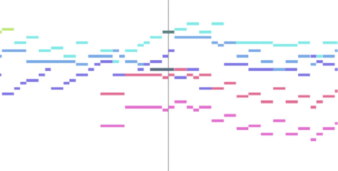
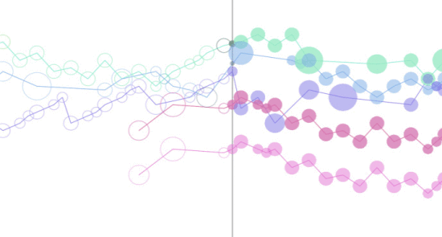
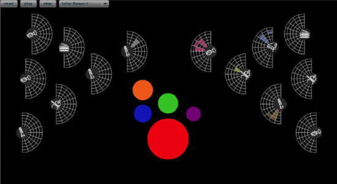

Week 9 - Creating Access to Music Through Visualization
===
By Andrew Nolan

I found this article from the IEEE Toronto International Conference on Science and Technology for Humanity while doing background research for my team's final project proposal. The authors of this paper propose that music visualizations could help deaf and hearing impaired individuals enjoy and understand the sentiments conveyed by music. They conducted a study evaluating several major types of music visualizations: Music Animation Machines (MAM), iTunes Visualizer's magnetosphere, and motion pixels of music (MPM) visualizations.

They used three different types of MAMs: MAM Piano Roll display, MAM Part Motion display, and MAM Tonal Compass display. Examples of these visualizations can be seen below:

MAM Piano Roll displays musical data by using bars, sometimes with different colors, to represent notes. It's a very commonly used method of music visualization. The line in the middle shows which notes are currently being played.

MAM Part Motion displays the same information as the piano roll. But instead of rectangles, it uses bubbles of varying sizes to show the length of the note. The dots fade away after the note is played.

The tonal compass MAM "arranges the pitches around a circle based on the circle-of fifths model". The size of circle shows the weight of the pitch. I am not familiar enough with music theory to tell you what all that means, but it is apparently useful for visualizing chords.

The iTunes visualizer is what the authors call a "Pretty Picture". By doing waveform analysis on the audio files it produces visualizations. The default vis, and what they tested on, is called a *magnetosphere*, because it appears similarly to magnetic fields around a sphere. This and the other visualizations in iTunes are very visually appealing, but do not represent any explicit information about the music data. The authors make an important point to mention these are designed to be visually stimulating, so even for "boring" songs they may mislead a viewer.

Motion of Pixels provides explicit music information including tonality, harmony, pitch, timing, instrumentation, and beat/rhythm info. It usually is used with MIDI files and can display info from all MIDI channels. The circles in the middle of the visualization are used to represent the tempo/beat information. The half circles on the outside show the different instruments and which notes they play at a given time. 

In my opinion these are all cool visualizations for music. But I did play saxophone in band in highschool and I have some interest/knowledge in music. These visualizations seem to be helpful for other musically minded people. In my opinion, and based on the results of this paper, these visualizations may not be interesting for deaf or hearing impaired persons. The results of the survey showed MAM is lacking, MPM was boring to those without musical training, and iTunes visualizer, while the most entertaining, did not provide important meaning to the music. While they may be nice supplements to music there does not appear to be an adequate music visualization tool that can be used by anyone yet. We can make any of these visualizations very fun by using complex songs, but for a normal song these visualization idioms may be lacking. To quote the paper "In terms of music, accuracy of visualization takes second stage to entertainment."

Sources
---
1. Creating Access to Music Through Visualization - https://ieeexplore.ieee.org/abstract/document/5444364