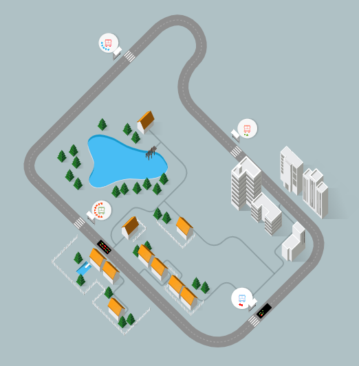

# Week 9 Reflection - [Why Do Buses Bunch?](https://setosa.io/bus/)

A visualization doesn't always have to be complex to convey a point. For example, this visualization only has two options: delay Bus 1 or delay Bus 2. However, those two interactions end up having a long term effect on the actual scene. This visualization goes over bus bunching which occurs whenever buses get delayed. When a bus is delayed for some period of time, then there will be more people waiting at the next stop. Any buses on the same route getting closer to the time the original bus was supposed to depart.

This visualization uses these two buttons to emulate this fact. Every stop gets a passenger every few seconds. As such, if a bus is delayed, there will be more passengers, and the bus might not be able to handle them all. Bus bunching occurs and the cycle of longer wait times persists.