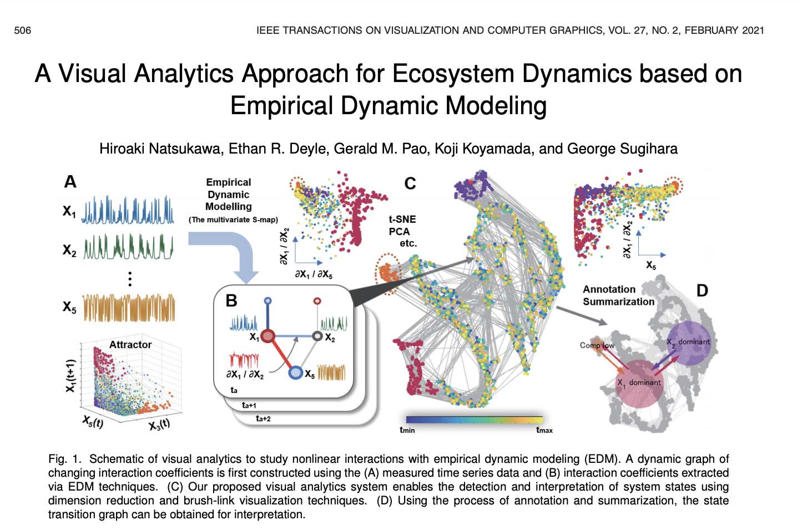

[A Visual Analytics Approach for Ecosystem Dynamics based on Empirical Dynamic Modeling](https://ieeexplore-ieee-org.ezpxy-web-p-u01.wpi.edu/document/9216532)

I chose this article because I may be using environmental sensor data for my final project and this seemed relevant. Empirical dynamic modeling (EDM) is an approach for "inductive data-science explorations of natural complex system. In the function of EDM, time-varying interactions can be calculated using the measured time series data, with this information defining a dynamic network." The paper investigates combining EDM with visualization techniques to assist in the task of analyzing complex relationships in ecological data. 

This article is pretty complex. I guess I can say the technique is recreating the dynamic system of relationships through time-series data? So with ecological data, analyzing how the changes in different variables over time are causally related. This article is a little beyond me as far as the data science. Perhaps having some exposure to this technique will be useful for my final project. 

Dimension reduction: "In two-dimensional mapping, a node represents a snapshot at a certain time point in the dynamic graph, and nodes at adjacent time
points are connected by links... The goal to use a dimension reduction plot is the identification of system states that is represented by a cluster of similar network 'snapshots'."

The authors conducted use case studies on an artificial food web data set and a marine mecocosm dataset to demonstrate its efficacy and utility. The use cases did help me to understand how their system works. 

It would have been interesting to be able to try the data analytics system they created for the paper. Then maybe I would have been able to understand it better. 
