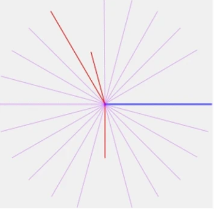
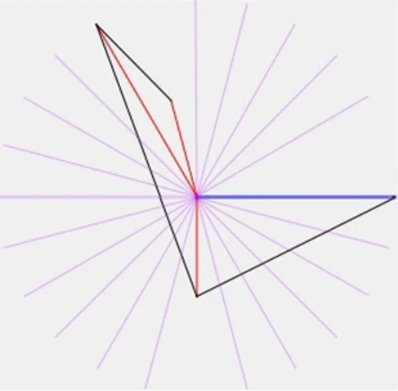
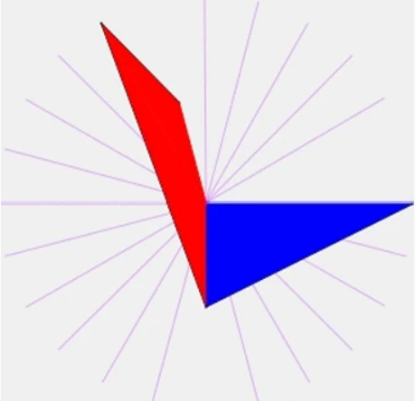
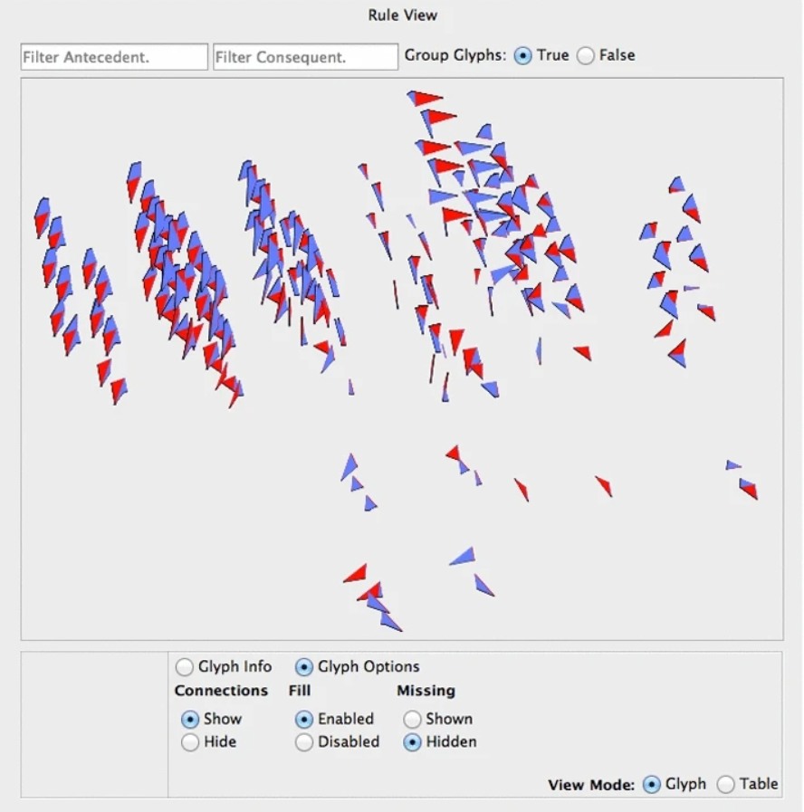

# Week 9 - FIRE: a two-level interactive visualization for deep exploration of association rules

[Paper link](https://link.springer.com/article/10.1007/s41060-018-0133-y)

Authors: 
Abhishek Mukherji, Xika Lin, Ermal Toto, Christopher R. Botaish, Jason Whitehouse, Elke A. Rundensteiner & Matthew O. Ward 

Source: 
International Journal of Data Science and Analytics volume 7, pages201–226(2019)

Abstract:
While rule mining is critical for decision-making applications, rule mining systems still lack support for interactive exploration of multitude of generated rules and understanding of relationships among rule results produced with various parameter settings. Based on a novel parameter space-driven approach, our proposed Framework forInteractiveRuleExploration [FIRE (PARAS/FIRE homepage: http://paras.cs.wpi.edu/)] addresses this usability shortcoming. FIRE features innovative visual displays and interactions to enable interactive rule exploration. We propose two linked interactive displays, namely the parameter space view (PSpace) and the rule space view (RSpace) that together enable enhanced sense-making of rule relationships. The PSpace view visualizes the distribution of rules produced for diverse parameter settings. This not only facilitates user parameter selection for rule mining but also enhances an analyst’s understanding of rule relationships in the parameter space context. The RSpace view provides a detailed display of the rules using a novel rule glyph visualization to facilitate interactive visual rule comparisons. We evaluate the usability and effectiveness of our FIRE framework with two studies. First, in a case study a researcher explored a dataset of interest using the FIRE paradigm as well as the state-of-the-art rule visualization techniques from the ARulsViz R package. Further, our user study with 22 subjects establishes the usability and effectiveness of the proposed visual displays and interactions of FIRE using several benchmark datasets. Overall, this research encompasses significant contributions at the intersection of data mining and visual analytics.

This paper was written by researchers in WPI, which makes me really proud. The most interesting part of this paper I think is Interactive visual rule space design part. Researchers made several lined glyph [figure 1], and color different figures by blue and red. Then they connected the ends of colored lines [figure 2], thus it became a whole new visualization of polygons [figure 3]. We can also take an overview of all data sets [figure 4]. I think it's really intelligence for the researchers to grab the polygon out of a radar chart and redesign it.

figure 1

figure 2

figure 3

figure 4