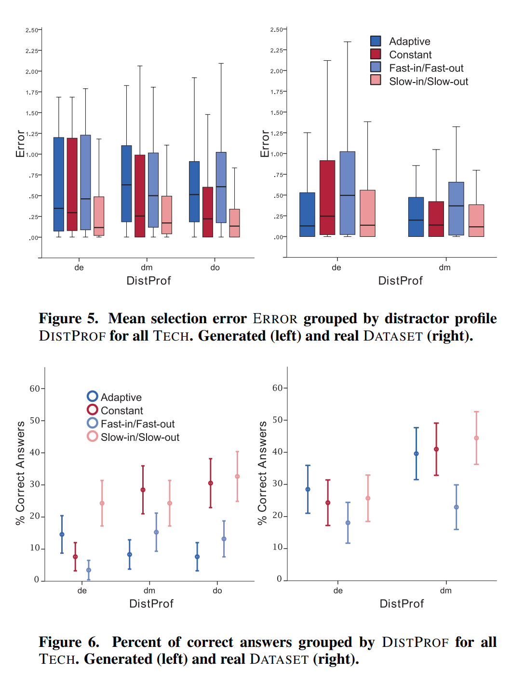

# Week 9 Reflection

## Temporal Distortion for Animated Transitions

This is a paper about a study on the effects of visual perception on different transition curves for animation in visualizations. These different transition curves modify the speed and movement of data points in a visualization, and are meant to help the user track changes in an interactive/animated visualization when looking at a specific data point. There are some challenges with measuring the performance of these animations, because different data points that are used in such an experiment might belong to a "complex" or "tight" cluster of datapoints at the beginning or end of a transition, or there might be significant overlap of datapoints when all of the elements move in the visuaization. They address this challenge by introducing a measurement for it that they call the "Distractor Profile" or "DistProf." Tasks with a DistProf > 1 are binned into group "d_e" (complex at both endpoints), and those with a DistProf contained in [0, 1] are denoted "d_m" (complex in the middle of the transition), and those with a constant time profile are denoted "d_o."

The results of this study showed that the "slow in slow out" method, or allocating frames to the beginning and end of transitions results in better tracking performance and lower temporal distortion, but also that allocating frames to the "most complex" points in the transition has a similar effect. "Slow in slow out" or "ease-in-out" animation has felt the go-to standard recently for animations and transitions, so it is reassuring to know that this has an actual impact on people's perception of visualization. However, it's also important to take into account the complexity of the datapoints and the difficulty users may have at tracking them throughout a transition, where "slow in slow out" may have an adverse effect and linear time may perform better - or creating a more custom animation curve based on this varying complexity.

### Source

https://engineering.purdue.edu/~elm/projects/timedistort/timedistort.pdf
