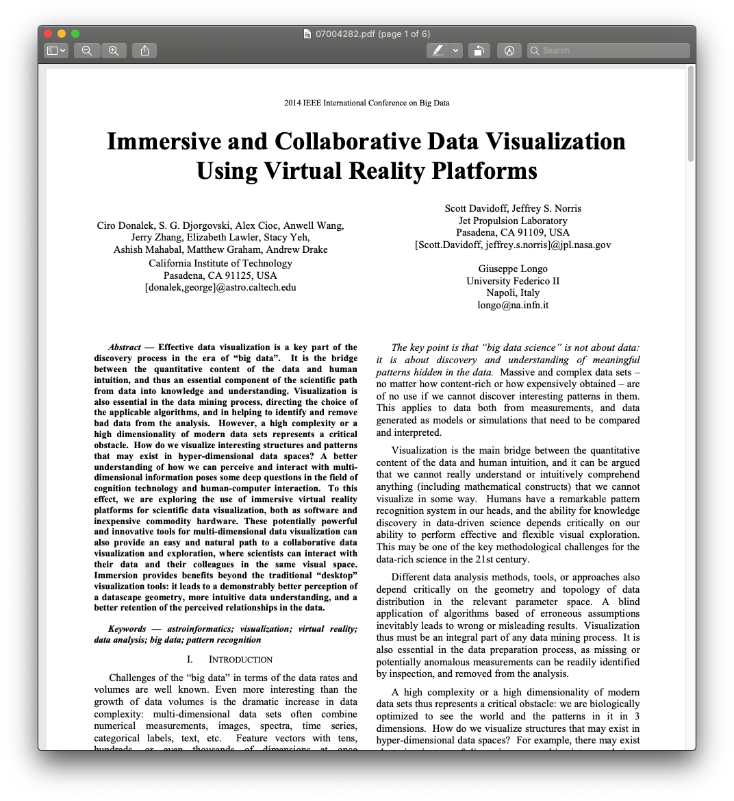
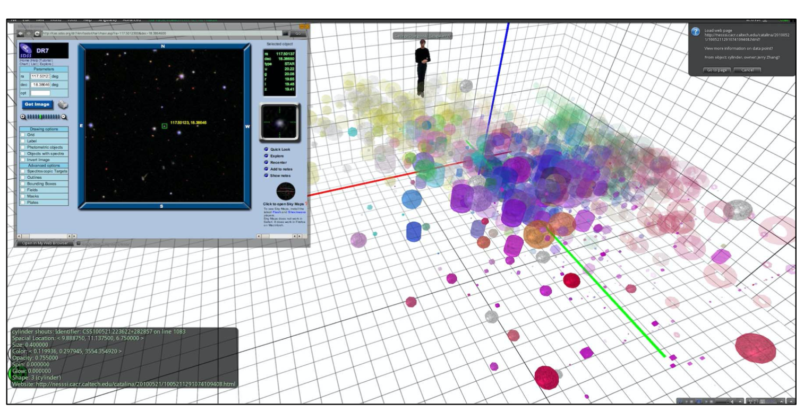
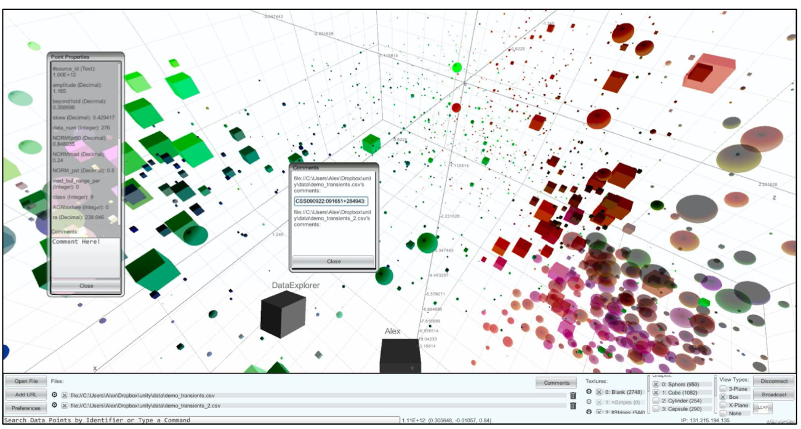
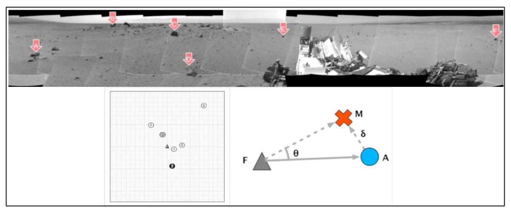

Week 9 Reflection
===

Author
---
Joseph Yuen

Paper
---
[Immersive and Collaborative Data Visualization Using Virtual Reality Platforms](https://ieeexplore.ieee.org/abstract/document/7004282)

Reflection
---

Aside from computer science work, I really like game design, and so this paper was interesting as it discusses the use of video game technology in other fields. I was first introduced to this concept when I watched a documentary on the Mandorian TV show. In the making of the show, the directors used Unreal Engine to create the 3D environments and then rigged a camera to act similarly to a VR headset in that it could navigate within the 3D environment. In a similar manner, these scientists wanted to use a variety of game engines in combination with VR technology to enhance scientific data visualizations. Even though this paper is from 2014 (and I will likely look at a more recent paper derived from this one), I think that it sets up a foundation for why the use of VR makes sense in the context of big data analysis.

In the age of big data, we have to acknowledge that the analysis of big data is extremely complex and requires multi-dimensional analysis. This complexity requires a visual model for more effective analysis as humans gain a better understanding of data when they can interact with it together in a virtual space. Thankfully, technology produced by the ever growing and innovative game industry has made it possible and affordable to interact in complex spatial environments on a simple laptop. The authors of the paper wanted to explore this tech. They first used "off the shelf" virtual worlds like OpenSim as seen below to visualize sky data, however, these programs did not tend to have a full feature set for data analysis and couldn't handle big data amounts of data. 

The authors then used iViz, a VR program based on Unity 3D that was able to provide adequate functionality, collaboration, and customization as seen in the image below. The program was much more optimized than other programs and could allow for deeper analysis. For example, upon selecting a point in the world, the user could view additional information on that point allowing for greater data exploration. Additionally, the program could be ran in a web page. The authors noted that this feature would encourage scientists to more easily adopt the technology as the standalone application may be linked to a "superficially 'game-like' environment." It's easy to forget that even scientists may be less inclined to use technologies due to societal biases that sometimes frown upon games.

Lastly, the authors wanted to see how much more effective VR was to other means of visualizing big data. They took Mars terrain data and created a large flat panorama image, as seen below, and also created a VR environment using a map editor written in Unity 3D. 

They had people who worked on the Mars project use the two visualizations. They found that both the panorama and VR systems gained positive reviews, yet the VR system was deemed superior from anecdotes. Although there was not a definitive winner, we see the potential of VR to be used in complex spatial environments where scientists can collaborate and interact with the data in a manner not possible before due to limits in technology and funding. 

I find these preliminary research papers to be especially interesting as they reveal the researcher's thought process in using a new technique that hasn't been done before. Since the paper was written 7 years ago, I find it fascinating how data viz has transformed over the years. In my limited experience, I haven't witnessed too many VR scientific data visualizations, so I find it slightly sad that this paper's research may not have taken off as the authors expected. However, I know that many defense contractors use VR for training which involve large amounts of spatial data and complex AI systems. These applications of VR may be a positive result of this research. Overall, I found the paper to be insightful and demonstrate that video game technology can go beyond the realm of shooting monsters and hopefully give humans new insights that were never able to discover before.