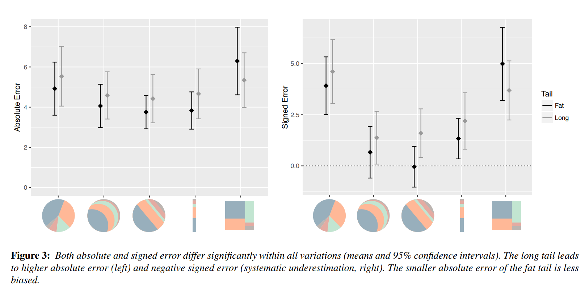

Refelction
====
The paper I found last week is about studying on part-to-whole chart. Part-to-whole charts are used to show part-to-whole relationship. In the designed experiment, the graphs shown to the participants included standard pie charts, circular pie charts, linear pie charts, bar charts, and tree charts. Each type of charts in experiment has 5 slices. During the experiment process, participants are asked about largest slice and middle slice. When asked about middle slice, there are two sub-case: long trail and fat trail.     
    
The author analyzes the results of both absolute errors and signed errors. When asked about largest slice, we can find that tree map has a poor performance than other types of chart in figure 2. When asked about the middle slice, there was no significant difference in performance to when asked about the largest film.    
    
In fat and long trail, although the results of absolute and signed error differ different, we can still find that tree map has poor performance in part-to-whole. In addition, the circular pie chart and straight pi chart have better performance than standard pie chart. I think this is cool, as the author said in the paper, maybe the circular pie chart may be an interesting alternative to the unpopular pie chart, because it performs better than the pie chart and is faster to read.    
    
